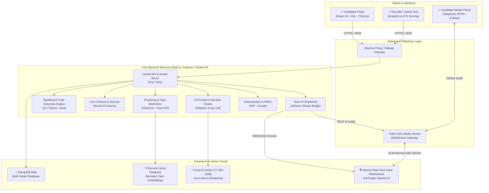
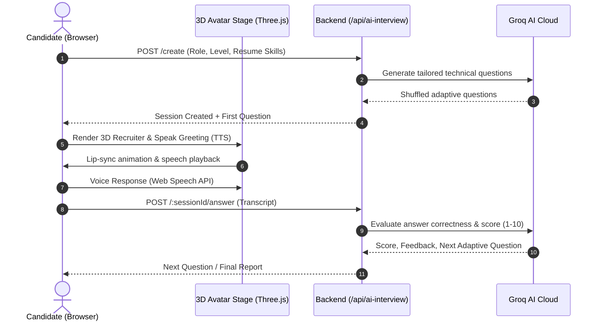
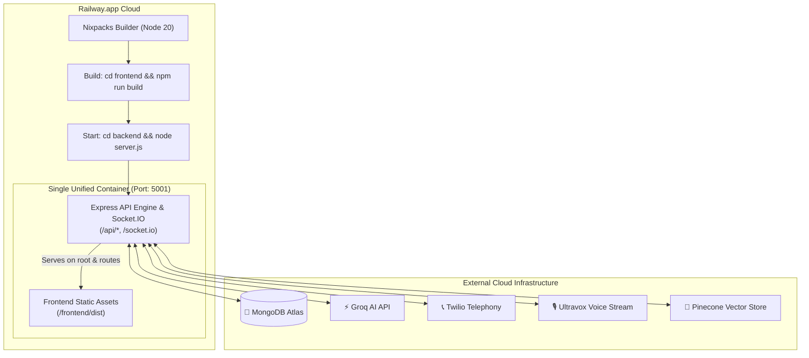

# 🏗️ EDU-AI System Architecture & Technical Specification

> **Next-Gen AI Learning, Placement, 3D Virtual AI Recruiter & Voice Telephony Platform**  
> **Repository**: [github.com/parthsharma17prs/eduai](https://github.com/parthsharma17prs/eduai)  
> **Version**: 2.0.0 Production Ready

---

## 1. Executive Summary

**EDU-AI** is a multi-modal, end-to-end recruitment, learning, and assessment ecosystem designed to streamline candidate evaluation, real-time code proctoring, 3D conversational avatar interviews, and automated telephonic voice screening.



---

## 2. Component Architecture

### 2.1 Frontend Architecture (`/frontend`)
- **Core Framework**: React 18 with Vite build tooling, React Router v7.
- **3D Graphics & Avatar Engine**: Three.js procedural avatar rendering, GLTF model loading with morph targets (`jawOpen`, `viseme_aa`, `mouthSmile`), and CSS holographic fallbacks.
- **Audio & Speech Pipeline**: Web Speech API for continuous speech-to-text recognition and browser SpeechSynthesis for voice playback.
- **State Management**: React Context (`FeatureProvider`), custom hooks for proctoring sensors, audio recording, and WebSocket event subscribers.
- **Styling**: Modern dark mode cyber aesthetic, glassmorphism, responsive flex/grid layouts, Lucide icons.

### 2.2 Backend Architecture (`/backend`)
- **Server Framework**: Node.js with Express (ES Modules), HTTP server integrated with Socket.IO.
- **Real-Time Layer**: Socket.IO namespace and room management for live peer-to-peer recruiter interviews, coding contests, and real-time live quizzes.
- **Security & Middleware**: Rate limiting, CSRF tokens, Helmet security headers, timeout guards, and flexible JWT authentication (`verifyAuth` and `verifyAuthOptional`).

---

## 3. Real-Time Data Flow Pipelines

### 3.1 3D AI Avatar Virtual Interview Flow


### 3.2 Twilio + Ultravox AI Phone Calling Pipeline
```mermaid
sequenceDiagram
    autonumber
    actor Candidate as Candidate (Mobile Phone)
    participant Dashboard as Candidate Dashboard
    participant Backend as Express Backend
    participant Twilio as Twilio Cloud (PSTN)
    participant Ultravox as Ultravox Voice AI Engine

    Dashboard->>Backend: POST /api/ai-calling/initiate-call (Phone Number)
    alt Number is not +918319556016
        Backend-->>Dashboard: Require OTP Verification
        Dashboard->>Backend: POST /api/ai-calling/verify-otp (Code: 482910)
        Backend-->>Dashboard: Verification Confirmed
    end
    Backend->>Ultravox: POST /api/calls (Recruiter System Prompt)
    Ultravox-->>Backend: joinUrl (WebSocket Stream Gateway)
    Backend->>Twilio: twilio.calls.create (TwiML with <Stream url="joinUrl" />)
    Twilio->>Candidate: Outbound Phone Call Ringing & Connect
    Twilio<->>Ultravox: Direct Bi-Directional PCM Audio Stream
    Ultravox<->>Candidate: Full-Duplex Voice Dialogue (Speech-to-Speech)
    Backend->>Dashboard: Live Call Status & Real-time Transcript Polling
```

---

## 4. Live Quizzes & Coding Contests Architecture

```mermaid
graph LR
    Host["👨‍🏫 Host / Company Admin<br/>(Creates Quiz / Contest)"] -->|POST /api/quiz/create| DB[("🍃 MongoDB")]
    Host -->|Socket Emit: host-join| SocketServer["🔌 Socket.IO Server"]
    
    Player1["👤 Candidate 1"] -->|Socket: join-quiz (CODE01)| SocketServer
    Player2["👤 Candidate 2"] -->|Socket: join-quiz (CODE01)| SocketServer
    
    SocketServer -->|Broadcast: auto-start / question-reveal| Player1
    SocketServer -->|Broadcast: auto-start / question-reveal| Player2
    
    Player1 -->|Emit: submit-answer| SocketServer
    Player2 -->|Emit: submit-answer| SocketServer
    
    SocketServer -->|Leaderboard Update| Host
    SocketServer -->|Live Ranking & Feedback| Player1
    SocketServer -->|Live Ranking & Feedback| Player2
```

---

## 5. Security, Proctoring & Biometrics

| Layer | Implementation | Protection |
| :--- | :--- | :--- |
| **Face Biometrics** | `face-api.js` + Pinecone Vector DB | Verifies candidate identity continuously; flags unauthorized face substitutions. |
| **Environment Sensor** | Dual-Camera Stream (Webcam + Mobile Feed) | 360-degree secondary view of candidate workspace. |
| **Anti-Cheating Detection** | Visibility API & Window Blur Tracking | Detects tab-switching, secondary monitors, copy-paste events. |
| **Phone Fraud Protection** | OTP Verification Engine | Restricts AI phone screening to verified phone numbers. |
| **API Armor** | Helmet + CSRF + Rate Limiting | Prevents DDoS, brute-force attacks, and cross-origin abuse. |

---

## 6. Railway & Cloud Deployment Topology



---

---

## 7. Comprehensive Technology Stack

| Domain | Technology / Library | Version / Specification | Purpose & Role |
| :--- | :--- | :--- | :--- |
| **Frontend Framework** | **React.js** | `^18.3.1` | Declarative component UI library for reactive single-page app |
| **Build Tool & Bundler** | **Vite** | `^5.4.21` | Lightning-fast HMR and optimized Rollup production bundling |
| **3D Rendering & WebGL** | **Three.js** | `^0.160.0` | Real-time 3D canvas rendering, lighting, camera, shaders & GLTF morph targets |
| **Motion & Micro-interactions** | **Framer Motion** | `^11.0.0` | Fluid animations, slide-overs, holographic glows, and state transitions |
| **Icons & Visuals** | **Lucide React** | `^0.344.0` | Modern SVG iconography with customized active cyber theme styling |
| **State & API Cache** | **TanStack React Query** | `^5.0.0` | Asynchronous query caching, optimistic UI updates, and stale-time controls |
| **Routing** | **React Router DOM** | `^7.0.0` | Dynamic client-side routing, protected routes, and role-based views |
| **Code Editor** | **Monaco Editor / CodeMirror**| `^0.45.0` | Embedded IDE with syntax highlighting, auto-completion, and multi-language support |
| **Backend Runtime** | **Node.js** | `>=20.0.0 LTS` | High-throughput asynchronous server-side JavaScript runtime |
| **Web Server Framework** | **Express.js** | `^4.19.2` | RESTful API routing, middleware chaining, and error handling |
| **Real-Time WebSockets** | **Socket.IO** | `^4.7.5` | Bi-directional event communication for live coding contests, quizzes & proctoring |
| **Primary Database** | **MongoDB Atlas & Mongoose**| `^8.3.0` | Scalable NoSQL document store with schema validation and indexing |
| **Vector Database** | **Pinecone** | `@pinecone-database/pinecone` | High-dimensional face biometric vector similarity search |
| **AI LLM Inference** | **Groq Cloud API** | `Llama 3.3 70B Versatile` | Ultra-low latency (<300ms) adaptive interview question generation & code evaluation |
| **Voice AI & Telephony** | **Ultravox Realtime API** | `v1 WebSocket Stream` | Full-duplex voice dialog engine with dynamic prompt injection |
| **Telephony Gateway** | **Twilio Voice API** | `Twilio SDK ^5.0.0` | PSTN mobile outbound calling with bi-directional WebSocket media streams |
| **Computer Vision / Biometrics** | **Face-API.js & TensorFlow.js** | `SSD Mobilenet v1` | Client-side facial detection, eye gaze tracking, and multiple person detection |
| **Speech-to-Text (STT)** | **Web Speech API & Deepgram** | Continuous Recognition | Real-time speech transcription during avatar and phone interviews |
| **Text-to-Speech (TTS)** | **SpeechSynthesis & ElevenLabs**| Neural Voices | Natural voice generation and avatar lip-sync viseme driving |
| **Security & Hardening** | **Helmet, bcrypt, jsonwebtoken**| Production Grade | JWT authentication, cryptographic password hashing, and HTTP security headers |
| **Containerization & Cloud** | **Railway Nixpacks & Docker** | Node 20 / Alpine | Cloud infrastructure deployment, automated CI/CD builds, and single-port serving |
| **Reverse Proxy & Routing** | **Express Static Proxy** | Native Node.js | Single-dyno architecture serving compiled `/dist` frontend + `/api` backend |

---

## 8. Development & Production Environment Matrix

```bash
# Node.js Environment
NODE_ENV=production
PORT=5001

# AI & LLM Engine Keys
GROQ_API_KEY=gsk_...
ULTRAVOX_API_KEY=...

# Cloud Voice & PSTN Telephony
TWILIO_ACCOUNT_SID=AC...
TWILIO_AUTH_TOKEN=...
TWILIO_PHONE_NUMBER=+1...
NGROK_URL=https://...

# Database & Vector Store
MONGODB_URI=mongodb+srv://...
PINECONE_API_KEY=...
PINECONE_INDEX=eduai-biometrics

# JWT & Authentication
JWT_SECRET=super_secret_jwt_key
```

